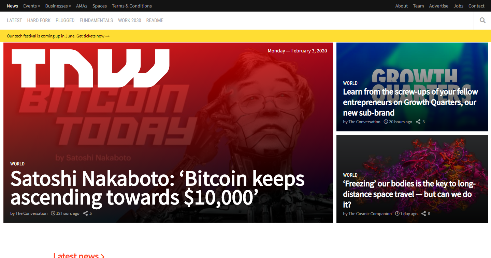
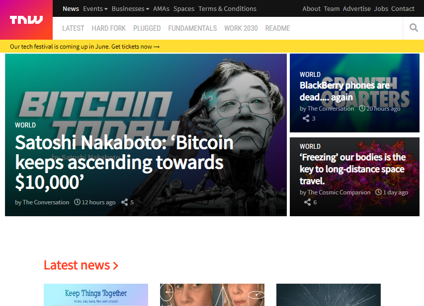
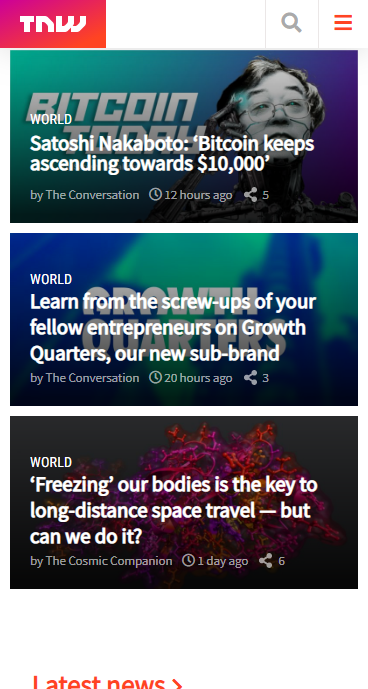

# Responsive_Designs

This project is a copy of the [TheNextWeb](https://thenextweb.com/) homepage.

>Screen shot in desktop screens

>Screen shot in tablet devices

>Screen shot in mobile devices

>Project built using basic HTML and CSS with media queries.

## What it does

It shows you a static copy of the [TheNextWeb](https://thenextweb.com/) homepage.
Built with media queries to support all devices.

## Built With

- HTML 5

- CSS 3

### and deployed to Raw Githack

## Live Demo

[Live Demo](https://rawcdn.githack.com/tirthajyoti-ghosh/Design-Teardown/82fc6e44bf6c2f373d7b322a4019812af4d62776/index.html)

## 🤝 Contributing

Contributions, issues and feature requests are welcome! Start by:

- Forking the project
- Cloning the project to your local machine
- `cd` into the project directory
- Run `git checkout -b your-branch-name`
- Make your contributions
- Push your branch up to your forked repository
- Open a Pull Request with a detailed description to the development branch of the original project for a review

## Attributions and Credit

- Microverse and TSEs
- The Odin Project

## Authors

👤 **Tirthajyoti Ghosh**

- Github: [@tirthajyoti-ghosh](https://github.com/tirthajyoti-ghosh)
- Twitter: [@TirthajyotiGho1](https://twitter.com/TirthajyotiGho1)
- Linkedin: [tirthajyoti-ghosh](https://www.linkedin.com/in/tirthajyoti-ghosh-370544199/)

👤 **Mbabali Iryn**

- GitHub [mbabaliiryn](https://github.com/mbabaliiryn)
- Twitter[@IrynMbabali](https://twitter.com/home)
- LinkedIn [Mbabali Iryn](https://www.linkedin.com/in/mbabali-iryn-206177177/)

## Show your support

Give a ⭐️ if you like this project!

## 📝 License

Free

### Enjoy🎉
